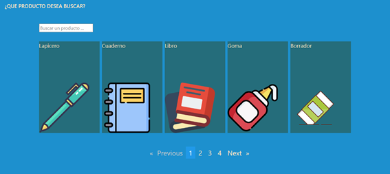
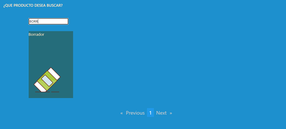

# RetoDelfosti

Este proyecto uso [Angular CLI](https://github.com/angular/angular-cli) version 15.0.0.

En este proyecto se uso json-server para la API falsa.

## Resumen del proyecto

Este proyecto fue creado para las personas amantes de los utiles escolares, donde podran previsualizar cada uno de los items, además de buscar en el buscador de la página para encontrar los productos con más facilidad.

## Vista del proyecto

